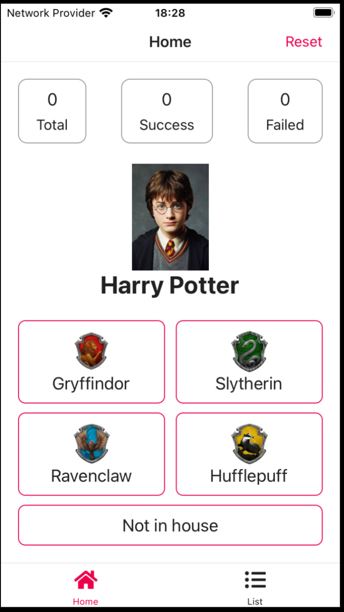
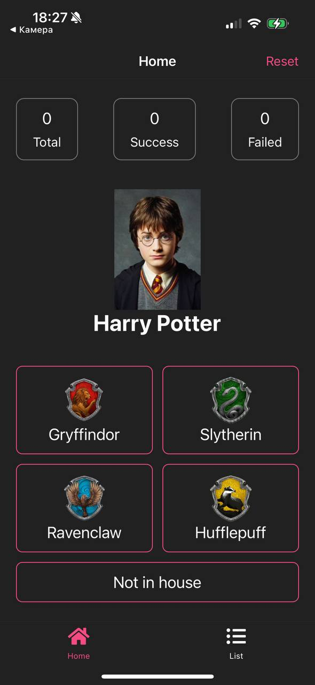
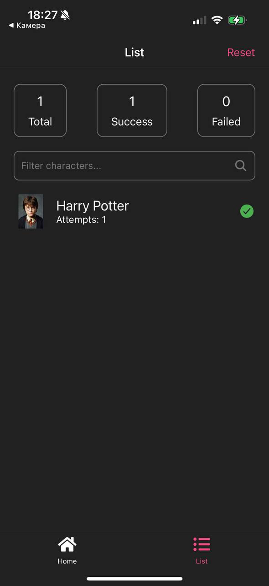
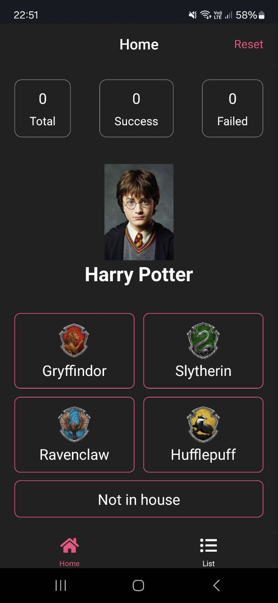
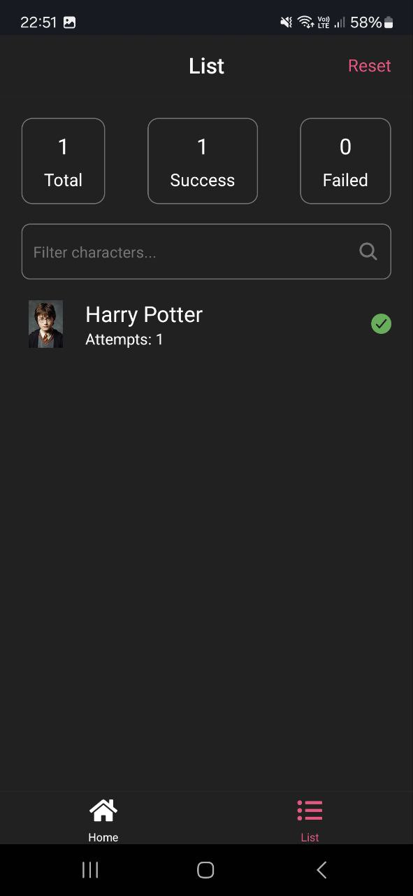

# Magic Hat

---

My [test task](https://github.com/nayfort/magic-hat-test-task)

### Features

- Pull to refresh the character
- Characters filtering by name
- Default character image if not provided by API
- Responsive layout: looks great on any iPhone or Android device
- Dark theme
- Stateful screens and “dummy” UI components
- `FlatList` items rendering optimization

#### iPhone SE (3rd generation)

<div>
  
  
  
</div>

#### iPhone 15 Pro

<div>
  
  
  
</div>

#### Samsung A35

<div>
  
  
  
</div>

### Tech Stack

- _TypeScript_
- _Expo_ - a framework recommended by React Native team for any greenfield app
- _Expo router_ - a new file-based approach to routing
- _Zustand + Axios_ - a lightweight and easy-to-use state manager and HTTP client, respectively.

### Run the app

- iOS

    ```shell
    expo start --ios
    ```

- Android

    ```shell
    expo start --android
    ```

#### Expo Go app

Download Expo Go app from App Store or Google Play and scan the QR-code generated by this command:

```shell
npm run start
```
