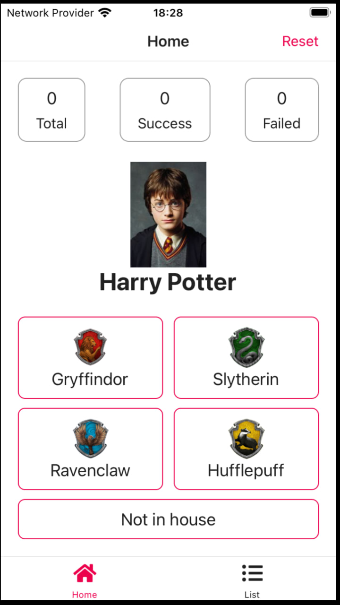
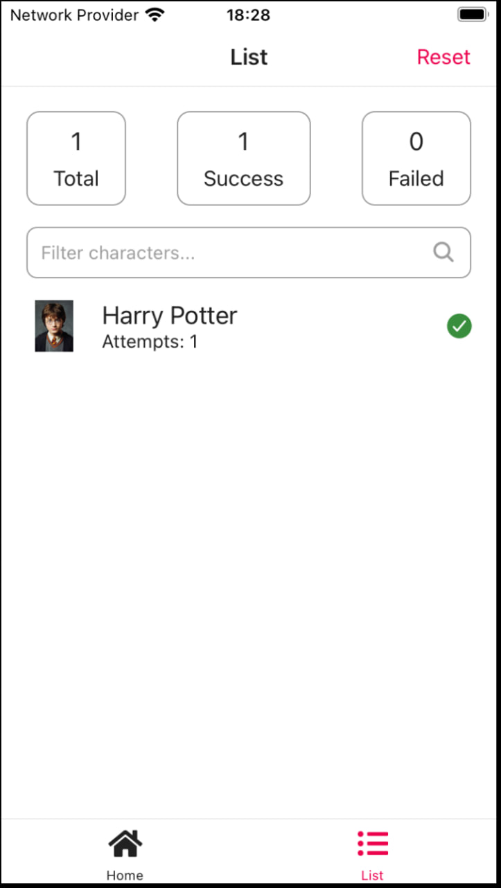
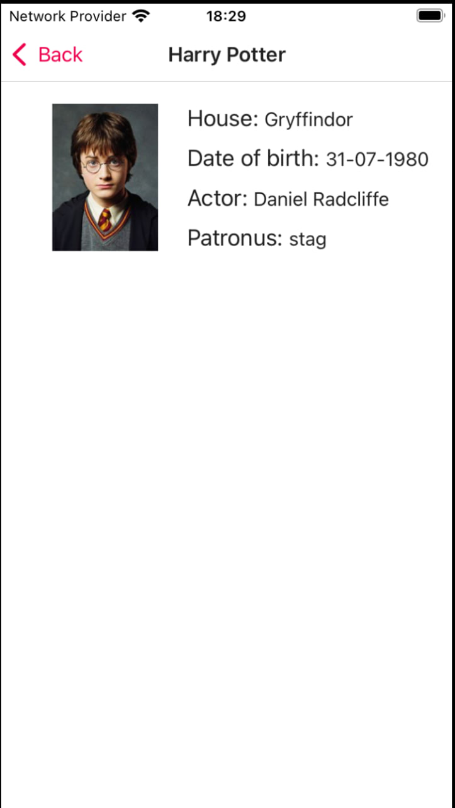
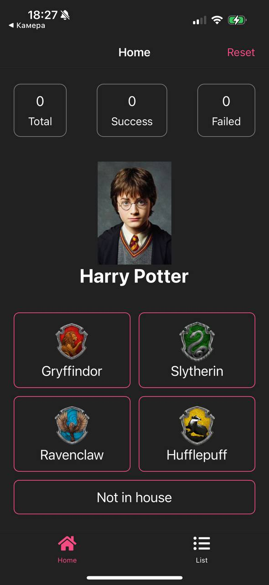
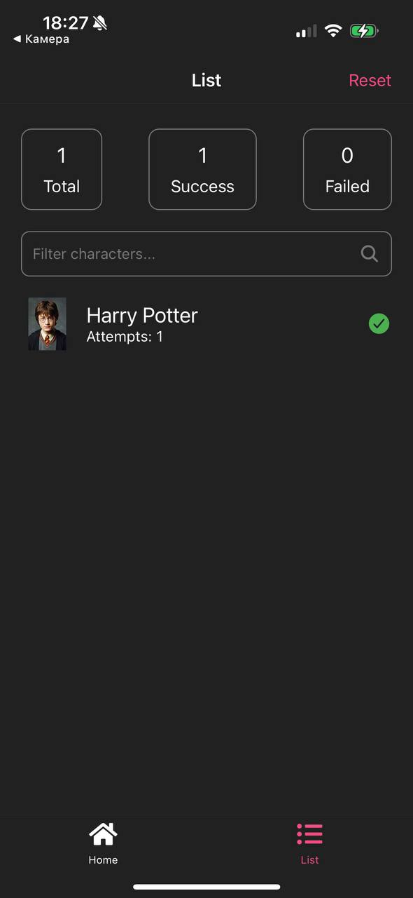
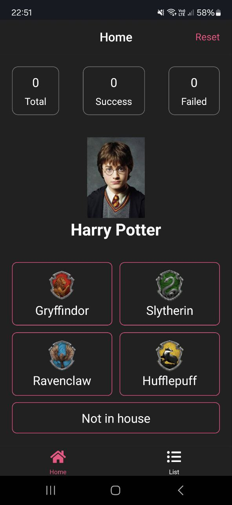
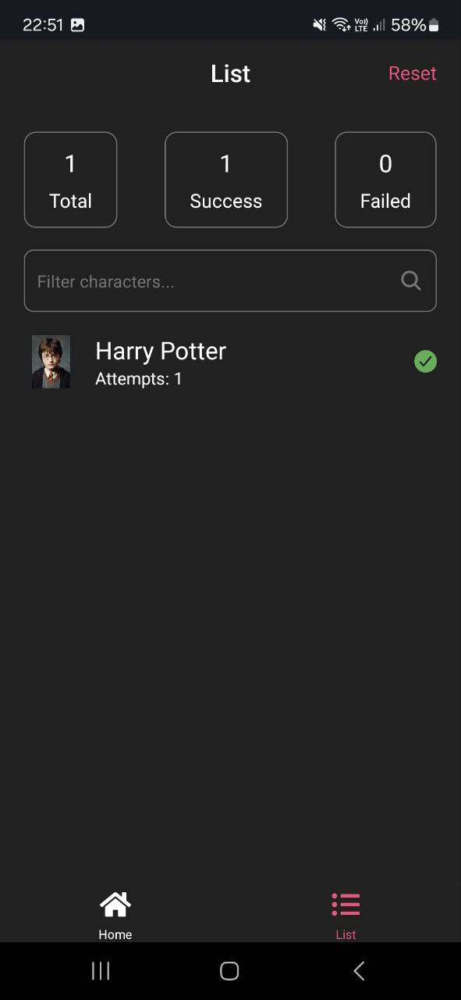
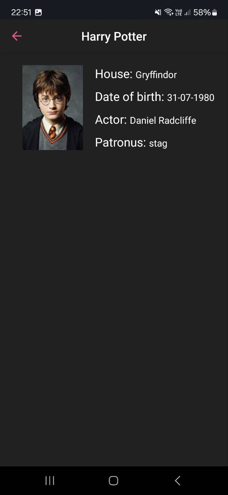

# Magic Hat

A Harry Potter house-guessing game for iOS and Android, built with React Native and Expo. Pick a character's Hogwarts house (or **Not in house**), track your attempts, and unlock their biography after a correct answer.

## Features

- Four house choices and a **Not in house** option.
- Total, successful, and failed attempt counters.
- Pull to refresh to select another character or retry a failed request.
- Guess history with case-insensitive name filtering and retry controls.
- Character biographies unlocked by correct guesses.
- Light and dark themes based on the device appearance.
- Placeholder images when the API does not provide a portrait.

## Requirements

- Node.js 22.13 or later in the Node 22 release line (`nvm use`).
- npm (included with Node.js).
- An Expo Go version compatible with SDK 57, or a compatible development build.
- Xcode and an iOS Simulator for local iOS testing (macOS only), or Android Studio and an Android emulator for Android testing.

## Getting started

```sh
git clone https://github.com/nayfort/magic-hat.git
cd magic-hat
nvm use
npm ci
npm start
```

Scan the QR code with a compatible Expo Go client, or launch an emulator:

```sh
npm run ios
npm run android
```

## Tech stack

Expo SDK 57, React 19.2, React Native 0.86, Expo Router, TypeScript, Zustand, and Axios.

## Data and game behavior

Character data comes from the public [HP API](https://hp-api.onrender.com/), without an API key or environment variables. The app fetches the character catalog once per session and chooses subsequent characters locally. Failed requests show an error; pull down to retry. Harry Potter is available as the initial character while data loads.

Each submitted answer counts as one attempt. Correctly guessed characters are excluded from future random selections. History and scores are kept in memory and disappear when the app restarts. **Reset** clears both and restores the initial character.

## Screenshots

#### iPhone SE (3rd generation)

<div>
  
  
  
</div>

#### iPhone 15 Pro

<div>
  
  
  
</div>

#### Samsung A35

<div>
  
  
  
</div>
